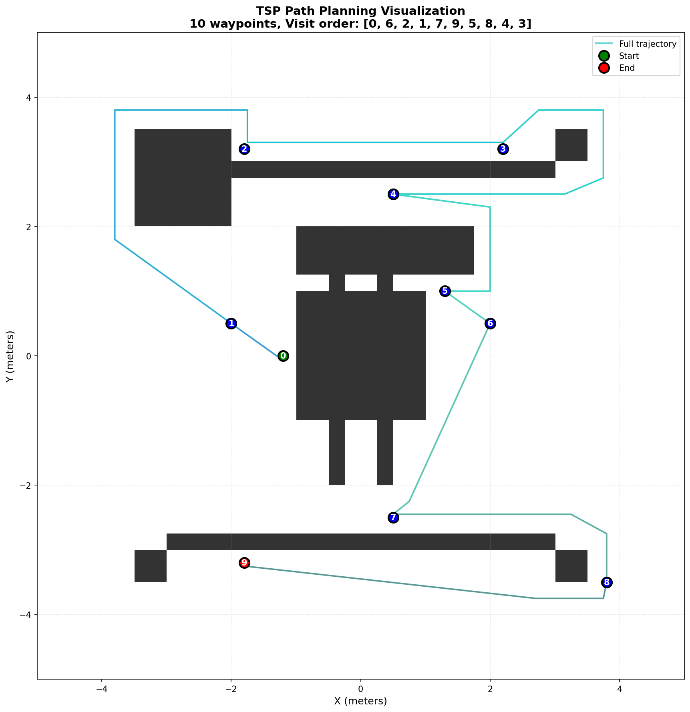
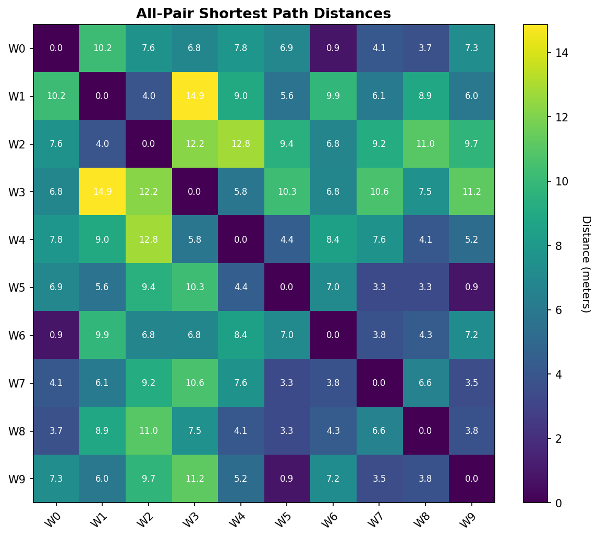

# TSP Path Planner

A complete path planning solution combining the Traveling Salesman Problem (TSP) optimization with A* shortest path algorithm for grid-based navigation.


## 🌟 Features

- **Complete Planning Pipeline**: Integrates TSP optimization with A* pathfinding
- **Optimal Waypoint Ordering**: Uses OR-Tools to solve TSP for minimal path cost
- **Collision-Free Paths**: A* algorithm ensures obstacle avoidance
- **Save/Load Solutions**: Persist planning results in NPZ or pickle format
- **Rich Visualization**: Static plots and animated robot navigation
- **Performance**: C++ TSP solver with Python fallback
- **Well-Tested**: Comprehensive unit tests with pytest

## 📋 Table of Contents

- [Installation](#-installation)
- [Quick Start](#-quick-start)
- [API Documentation](#-api-documentation)
- [Examples](#-examples)
- [Visualization](#-visualization)
- [Performance](#-performance)
- [Development](#-development)
- [Troubleshooting](#-troubleshooting)
- [License](#-license)

## 🚀 Installation

### Prerequisites

- Python 3.8 or higher
- C++ compiler (for building OR-Tools extension)
- OR-Tools library

### Step 1: Clone the Repository

```bash
git clone https://github.com/vaithak/TSP-all-pair-shortest.git
cd TSP-all-pair-shortest
```

### Step 2: Install Python Dependencies

```bash
pip install -r requirements.txt
```

### Step 3: Install the Package

```bash
pip install -e .
```

This will attempt to build the C++ TSP solver extension using pybind11 and OR-Tools. If the C++ build fails (e.g., missing compiler or OR-Tools), the package will still install and fall back to a Python-based nearest-neighbor TSP solver at runtime.

## ⚡ Quick Start

```python
import numpy as np
from tsp_path_planner import TSPPathPlanner, visualize_grid

# 1. Create a navigable grid (True = free, False = obstacle)
navigable_map = np.ones((100, 100), dtype=bool)
navigable_map[30:70, 45:55] = False  # vertical wall

# 2. Define waypoints as [x, y] coordinates in meters
waypoints = np.array([
    [0.0, -2.0],
    [2.0, 1.5],
    [-1.0, 2.0],
    [1.5, -1.5],
    [-2.0, -1.0],
])

# 3. Create planner and solve
planner = TSPPathPlanner(navigable_map.T, pixels_per_meter=20)
solution = planner.plan(waypoints, start_index=0)

# 4. Inspect results
print("Visit order:", solution['ordered_indices'])
print("Total cost:", f"{solution['total_cost']:.2f}m")

# 5. Visualize
visualize_grid(
    navigable_map, waypoints,
    ordered_indices=solution['ordered_indices'],
    full_path=solution['full_path'],
    segment_paths=solution['segment_paths'],
    pixels_per_meter=20,
    save_path="output/visualization.png"
)

# 6. Save / load
planner.save_solution(solution, "output/solution.npz")
loaded = planner.load_solution("output/solution.npz")
```

## 📖 API Documentation

<details>
<summary><b><code>TSPPathPlanner</code></b> — Main planning class</summary>

#### Constructor

```python
TSPPathPlanner(navigable_map, pixels_per_meter=20, astar_config=None)
```

| Parameter | Type | Description |
|---|---|---|
| `navigable_map` | `np.ndarray` (2D, bool) | Grid map where `True` = free cell, `False` = obstacle |
| `pixels_per_meter` | `int` | Grid resolution (default: 20) |
| `astar_config` | `dict` or `None` | Optional A\* configuration (see below) |

**A\* Configuration Keys:**

| Key | Default | Description |
|---|---|---|
| `waypoint_threshold` | `0.3` | Distance (m) to consider a waypoint reached |
| `max_speed` | `0.25` | Maximum linear speed (m/s) |
| `max_angular_speed` | `0.15` | Maximum angular speed (rad/s) |
| `dilation_radius` | `0.0` | Obstacle safety margin (m) |
| `dilation_retry_step` | `0.05` | Dilation reduction per retry (m) |

</details>

<details>
<summary><b><code>plan(waypoints, start_index=0, input_interval=0.5, verbose=True)</code></b> — Complete planning pipeline</summary>

Runs the complete pipeline: all-pair A\* distances, TSP optimization, and trajectory generation.

**Returns** a dictionary:

| Key | Type | Description |
|---|---|---|
| `waypoints` | `np.ndarray (N, 2)` | Original waypoints |
| `ordered_indices` | `list[int]` | Optimal visit order |
| `distance_matrix` | `np.ndarray (N, N)` | All-pair shortest path distances |
| `full_path` | `np.ndarray (M, 2)` | Dense trajectory for the robot to follow |
| `segment_paths` | `list[np.ndarray]` | Individual path segments between consecutive waypoints |
| `total_cost` | `float` | Total path length in meters |
| `metadata` | `dict` | Resolution, map shape, computation time, etc. |

</details>

<details>
<summary><b><code>compute_all_pair_distances(waypoints, verbose=True)</code></b> — A* distance matrix</summary>

Computes shortest-path distances between every pair of waypoints using A\*. Returns an `(N, N)` symmetric distance matrix.

</details>

<details>
<summary><b><code>solve_tsp(distance_matrix, start_index=0)</code></b> — TSP optimization</summary>

Solves the TSP on a precomputed distance matrix. Returns `(ordered_indices, total_cost)`.

</details>

<details>
<summary><b><code>compute_full_path(waypoints, ordered_indices, input_interval=0.5, verbose=True)</code></b> — Trajectory generation</summary>

Generates a dense trajectory following the given waypoint order. Returns `(full_path, segment_paths)`.

</details>

<details>
<summary><b><code>save_solution / load_solution</code></b> — Persistence</summary>

#### `save_solution(solution, filepath, format='npz')`

Saves a solution dictionary to disk. Supported formats: `'npz'` (compressed numpy archive) and `'pickle'`.

#### `load_solution(filepath, format='npz')`

Loads a previously saved solution from disk.

</details>

<details>
<summary><b>Visualization Functions</b></summary>

```python
from tsp_path_planner import visualize_grid, create_animation
from tsp_path_planner.visualization import plot_distance_matrix
```

| Function | Description |
|---|---|
| `visualize_grid(navigable_map, waypoints, ordered_indices, full_path, segment_paths, ...)` | Static plot of the map, obstacles, waypoints, and paths |
| `create_animation(navigable_map, full_path, waypoints, ordered_indices, ..., save_path=...)` | Animated GIF/MP4 of the robot following the planned trajectory |
| `plot_distance_matrix(distance_matrix, waypoint_labels=None, save_path=None)` | Heatmap of the all-pair shortest-path distance matrix |

</details>

## 💡 Examples

### Simple Example

A 5 m x 5 m grid with a vertical wall and 5 waypoints:

```bash
python examples/simple_example.py
```

This will:
1. Create a 100x100 grid with an obstacle
2. Plan an optimal route through 5 waypoints
3. Save the solution, a path visualization, and a distance matrix heatmap to `output/`

### Complex Example

A 10 m x 10 m grid with multiple obstacles and 10 waypoints:

```bash
python examples/complex_example.py
```

This will additionally:
- Generate an animated GIF of the robot navigating the path
- Compare the TSP-optimized route against a naive nearest-neighbor baseline

## 🎨 Visualization

Sample outputs from the complex example:

**Path Visualization** -- shows the navigable map, obstacles, waypoints (numbered by visit order), and color-coded path segments:



**Distance Matrix** -- heatmap of all-pair shortest-path distances between waypoints:



**Navigation Animation** -- robot following the planned trajectory:


## ⚙️ Performance

- **TSP Solver**: The primary solver uses Google OR-Tools (C++ via pybind11) with a `PATH_CHEAPEST_ARC` first-solution strategy and a 30-second time limit. If the C++ extension is unavailable, a Python nearest-neighbor greedy heuristic is used as a fallback.
- **A\* Pathfinding**: Uses an octile distance heuristic with 8-directional movement. Includes path smoothing via line-of-sight simplification and automatic dilation fallback when paths are blocked.
- **Complexity**: Computing all-pair distances requires `N*(N-1)/2` A\* searches, where `N` is the number of waypoints.

## 🛠️ Development

### Project Structure

```
TSP-all-pair-shortest/
├── tsp_path_planner/          # Main package
│   ├── __init__.py
│   ├── path_planner.py        # TSPPathPlanner class
│   ├── astar_planner.py       # A* pathfinding
│   ├── astar_utils.py         # Coordinate conversions, map utilities
│   ├── tsp_solver.py          # TSP solver (C++ / Python fallback)
│   ├── visualization.py       # Plotting and animation
│   └── cpp/                   # C++ OR-Tools bindings
│       ├── tsp_solver.cpp
│       ├── tsp_solver.h
│       └── pybind_wrapper.cpp
├── examples/
│   ├── simple_example.py
│   └── complex_example.py
├── tests/
│   └── test_planner.py
├── output/                    # Generated visualizations
├── requirements.txt
├── setup.py
└── README.md
```

### Running Tests

```bash
pytest tests/test_planner.py -v
```

The test suite covers planner initialization, all-pair distance computation, TSP solving, full path generation, obstacle avoidance, save/load round-tripping, different start indices, and edge cases (1-2 waypoints).

## ❓ Troubleshooting

| Problem | Solution |
|---|---|
| **C++ extension fails to build** | Ensure a C++ compiler supporting C++17 is installed. The package will fall back to the Python TSP solver automatically. |
| **`ImportError: _tsp_solver_cpp`** | The C++ extension was not built. Reinstall with `pip install -e .` or use the Python fallback (happens automatically). |
| **No path found between waypoints** | A waypoint may be inside or too close to an obstacle. Try increasing `dilation_radius` or adjusting waypoint positions. |
| **Animation fails to save as MP4** | `ffmpeg` is required for MP4 export. Install it or use GIF format instead (the code falls back to GIF automatically). |
| **Matplotlib window does not appear** | Set `show=False` and use `save_path` to write to a file, which works in headless environments. |

## 📄 License

This project is licensed under the MIT License.
